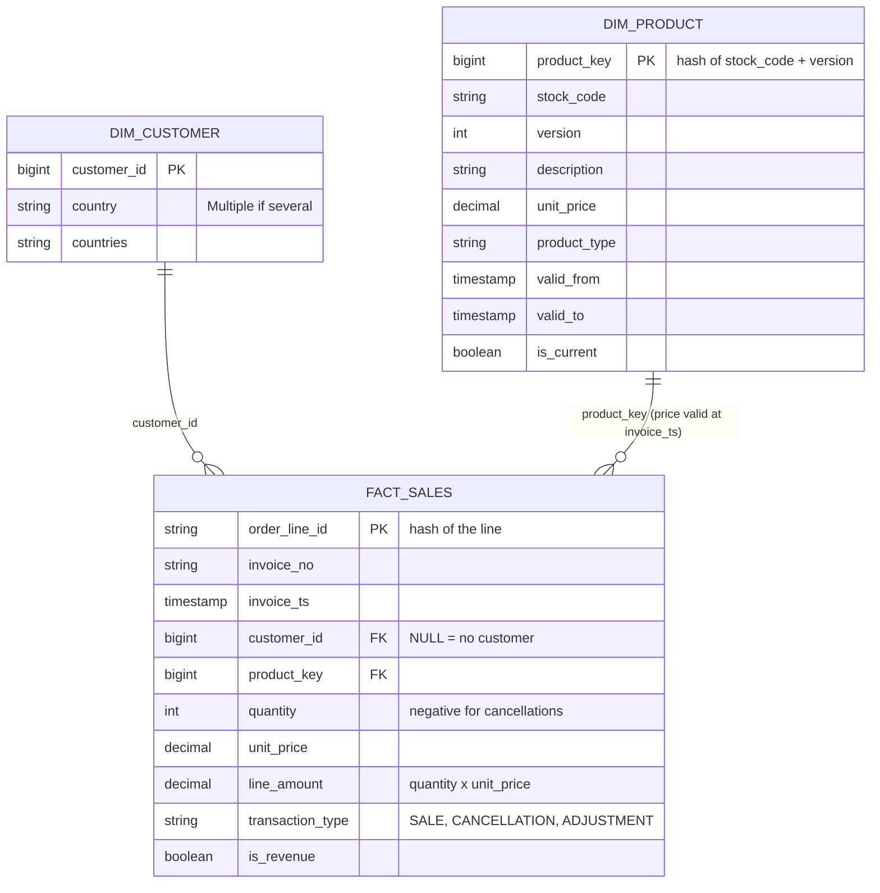

<!-- AI-assisted: written with the help of an AI coding assistant (Claude Code). -->

# Data model

## Star schema

- `fact_sales`: one row per order line.
- `dim_product`: SCD type 2, one row per price version. Each order line gets the version
  where `valid_from <= invoice_ts < valid_to`.
- `dim_customer`: SCD type 1, one row per customer.

## Price dating

The current price (top row of the file) is valid from the month of the latest order
(2011-12-01 for this data), each older price one month earlier, the oldest from 1900-01-01.
Example, product 10080:

| File line | Description | Price | Valid from | Valid to |
|---:|---|---:|---|---|
| 4 | GROOVY CACTUS INFLATABLE | 4.00 | 2011-12-01 | 9999-12-31 |
| 5 | (blank) | 3.24 | 2011-11-01 | 2011-12-01 |
| 6 | check | 0.12 | 1900-01-01 | 2011-11-01 |

## Silver

| Table | Key | Columns |
|-------|-----|---------|
| customers | customer_id | country, countries |
| products | stock_code, version | description, description_raw, unit_price, product_type |
| orders | order_line_id | invoice_no, stock_code, quantity, invoice_ts, customer_id, transaction_type |

Silver tables keep `_source_file`, `_row_id` and `_ingested_at` to trace a row back to bronze.

## Partitioning

| Table | Partition |
|-------|-----------|
| bronze.orders | `days(_ingested_at)` |
| silver.orders, gold.fact_sales | `months(invoice_ts)` |

The other tables are small and not partitioned. The dimensions are broadcast in joins.
